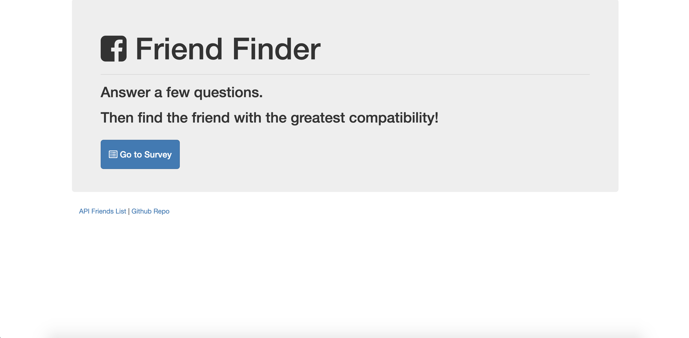
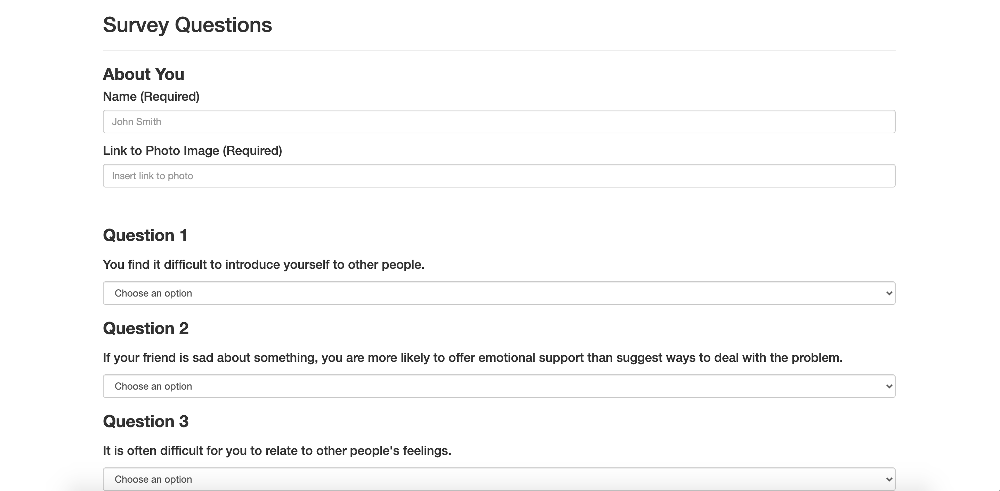

# Friend Finder

Friend Finder is all compatilibty-based application (basically a dating app but for friends) using Node and Express servers. This site will take in results from your users' surveys, then compare their answers with those from other users. The app will then display the name and picture of the user with the best overall match.

## Getting Started
Click <a href="https://tranquil-big-bend-81077.herokuapp.com/">here</a> to start!

## Screen Shots

## Technologies Used
- Node.js - Download the latest version of Node https://nodejs.org/en/
- Express NPM Package
- body-parager NPM Package - https://www.npmjs.com/package/inquirer
- path NPM Package - https://www.npmjs.com/package/path
- HTML
- Bootstrap
- JavaScript
- jQuery
